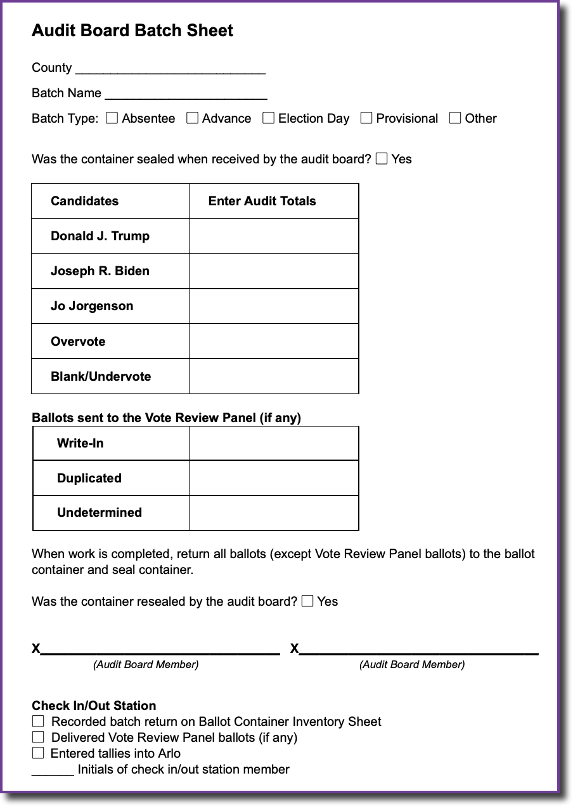

# Audit Board Guide

Audit boards must be comprised of two people and will be responsible for sorting and tallying the votes in the Presidential race for each ballot in a batch. Be sure to keep tables clear of anything (especially food and beverage) other than ballots and required documentation. Audit Board members will direct _any and all_ procedural questions to the Election Superintendent or their designee by raising their question mark sign.

## Audit Board Video Guide



## Audit Board Table Organization

## Ballot Batches

The audit board will review ballots in batches. The batch names and the number of ballots in each batch for the hand tally do not need to match the batches that were originally uploaded in the Ballot Manifest. You must ensure that the total number of ballots you hand tally matches the total number of ballots that were in your Ballot Manifest, which will also match the total number of ballots in the tally you submitted to the state for certification.

## Audit Board Steps

When reviewing a ballot and determining the voter’s mark, audit boards must consider “if the elector has marked his or her ballot in such a manner that he or she has indicated clearly and without question the candidate for whom he or she desires to cast his or her vote.” O.C.G.A. 21-2-438(c).

As a batch is delivered from the check-in/out station:

1. Record the County Name, Batch Name, and Batch Type (Absentee, Advanced Voting, Provisional, Election Day), and verify the container was sealed on the Audit Board Batch Sheet.
2. Unseal the container.
3. Recount the Ballots using the "Sort and Stack" method:
   1. Pull the ballots out of the container and stack neatly on the table.
      1. If the container contains more than 1000 ballots, ballots should be removed from the container and sorted in manageable stacks (using an _Audit Board Batch Sheet_ for each stack), leaving the rest of the ballots in the container until the previous stack is done.
   2. For each ballot: audit board member (ABM) #1 picks up a single ballot from the stack and reads the vote for the Presidential contest aloud, then hands the ballot to ABM #2. ABM #2 verifies the vote that is on the ballot is indeed what ABM #1 read, then places the ballot in the “stack” that corresponds to the vote. ABM #1 should watch to make sure the ballot is placed in the right stack. There will be 8 stacks as follows:
      1. Trump
      2. Biden
      3. Jorgensen
      4. Overvoted ballots - one pile for any ballot where the voter made more than one selection for President.
      5. Blank/Undervoted ballots - one pile for any ballot where the voter made no selection for President.
      6. Write-In - one pile for any ballot containing a write-in vote for President. (The board does \*NOT\* need to determine whether the write-in is for a qualified candidate: the Vote Review Panel does that.)
      7. Duplicated ballots - one pile for ballots marked as duplicated.
      8. Undetermined - one pile for any ballot where the audit board cannot agree on the voter’s intent.
   3. Candidate Ballot Tallies – Count the ballots in each stack by having one member of the audit board verbally count the ballot while handing it to the other member for verification. Count the ballots in groups of 10, stacking the groups at right angles to each other, so you can easily count the complete groups when you are done. (For instance, if you have seven groups of 10 ballots each plus an extra 3 ballots, the total tally would be 73.) Record the **total tally** for each candidate on the _Audit Board Batch Sheet._
   4. Write-In, Duplicated, and Undetermined Ballots - count the ballots in the write-in duplicated, and undetermined ballot piles and record on the _Audit Board Batch Sheet._ Each type should go in a designated folder or envelope by batch.
4. Write-in, Duplicated, and Undetermined ballot folders must be set aside for delivery to the Vote Review Panel.
5. Return the other ballots to the original container and seal the container.
6. Sign the _Audit Board Batch Sheet_.
7. Raise your check mark sign for the check-in/out station to come retrieve your container, batch sheet, and any ballots for the Vote Review Panel.

