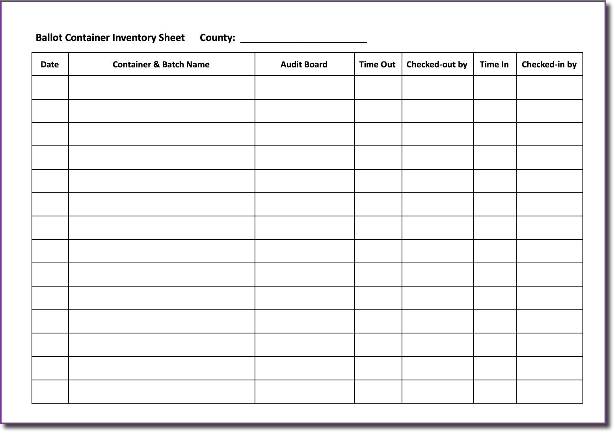

# Check-In / Check-Out Guide

At a minimum, two people are needed to check ballots in/out to audit boards for chain of custody as well as keep inventory of the ballot containers audited. One person should be stationed with the ballot containers at all times while another person delivers containers to and from the audit boards (a “runner”). This keeps the audit boards stationary and provides a methodical process for keeping track of each container. If you have more than a few audit boards, be sure to add an additional runner for every 5 audit boards to ensure the delivery and pick-up of ballot containers is not a bottleneck in the process.

## Check-Out

When a check-in/out station member delivers a container to an audit board, the batch name and audit board number should be recorded on the _Ballot Container Inventory Sheet._ Audit boards should start with absentee and provisional ballot containers.

## Check-In

When an audit board indicates it has completed their tasks, the check-in/out station member should:

* verify proper completion of the _Audit Board Batch Sheet_
* ensure the container is resealed
* return the container and batch sheet to the check-in/out station
* note the return of the container on the _Ballot Container Inventory Sheet_
* deliver any necessary ballots/envelopes to Vote Review Panel (duplicates, write-ins, undetermined)
* enter the candidate totals for the batch into Arlo and mark the batch sheet as “entered”


Do not enter the write-in candidates from the _Audit Board Batch Sheet_. Only enter from the _Vote Review Panel Tally Sheet._ &#x20;


## Arlo Data Entry

### Set Number of Audit Boards

* On first login, after clicking county name, Arlo prompts for a number of audit boards.
* Select your number of audit boards and click `Save & Next`
* If you have more than 15 Audit Boards, just select "1" and click  `Save & Next`

.png>)

### Add Batch

To add a batch to Arlo:

* click `+Add Batch`
* enter the batch name, type and vote totals from the batch sheet.
* Click `Save Results` to save the entered batch data and repeat for each batch.

### **Adding data from the Vote Review Panel**

When entering information from the Vote Review Panel Tally Sheet, just create new batches in Arlo.  Use the original batch name, followed by “VRP” and what type of ballots they were (Duplicated, Write-In, or Undetermined).  Feel free to abbreviate any of those names, we're just looking for a way to identify how they were written on the tally sheet.&#x20;

For example, when entering data about Batch 1 from the Vote Review Panel Tally Sheet, you would create several new batches that would be called “Batch 1 VRP Duplicated”, “Batch 1 VRP Write-in”, and “Batch 1 VRP Undetermined”

Please note: your undetermined ballots should have been decided by the Vote Review Panel as a vote for someone, blank, or overvote.  There is no place for an undetermined ballot in Arlo.

### Conclusion of each day

When completing work each day, please ensure the following tasks are complete:

* All audit boards have completed the batch they are working on
* All ballot containers have been checked back in
* All completed Audit Board Batch Sheets have been entered into Arlo
* All completed Vote Review Panel Tally Sheets have been entered Arlo
* All Audit Board Batch Sheets & Vote Review Panel Tally Sheets are scanned and the scanned images emailed to your SoS liaison&#x20;
* All ballot containers are in a secure location

### Finalize Results

When all batches have been entered for an audit board, click `Finalize Results` and confirm finalization the subsequent modal to complete data entry.


This action cannot be undone. Please do not finalize results until all batch data has been entered.


