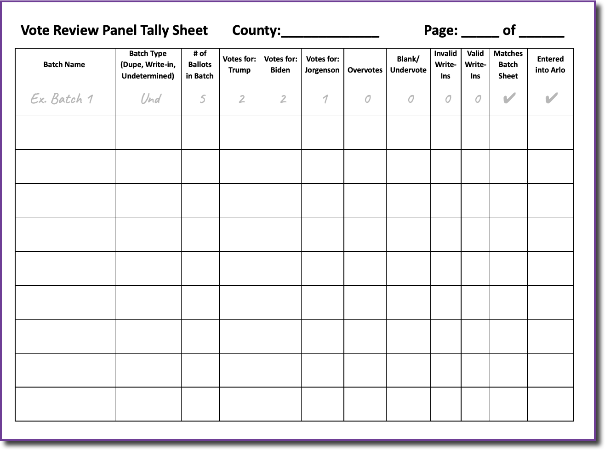

# Vote Review Panel Guide

Various types of ballots will be delivered to the Vote Review Panel after an audit board has completed their work.

The Vote Review Panel should complete the following tasks for each type of ballot:\

* **Duplicated Ballots** - Retrieve the original ballot and compare the duplicated ballot to ensure proper duplication. Using the original ballot, record the vote tally for the duplicated ballots using the _Vote Review Panel Tally Sheet._
* **Undetermined Ballots** - Review the undetermined ballots where the audit board could not agree on the voter’s intent to make a determination. Record the vote tally for the undetermined ballots using the _Vote Review Panel Tally Sheet._
* **Write-In Ballots** - Review the write-in ballots to determine if a voter has voted for a qualified or invalid write-in candidate. Record the number of votes for each qualified write-in candidate on the _Qualified Write-In Candidate Tally Sheet_.

As _Vote Review Panel Tally Sheets_ are completed, return them to the check in/out station for entry into Arlo.
